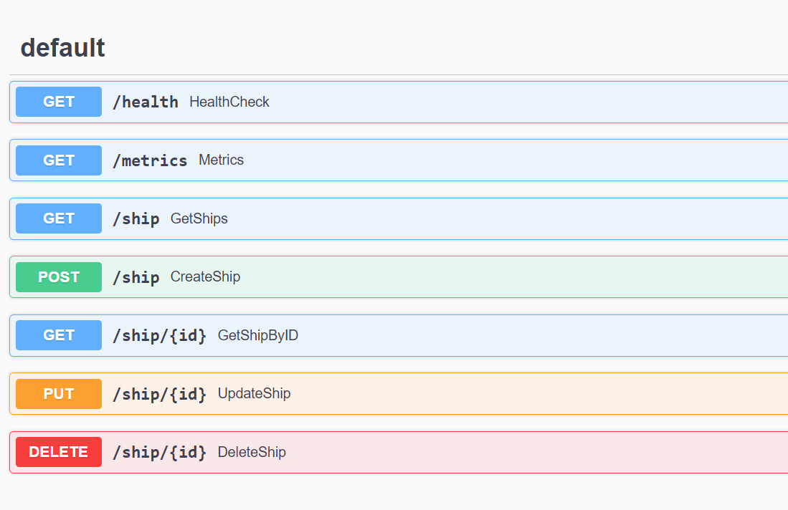

University: [ITMO University](https://itmo.ru/ru/)  
Faculty: [FICT](https://fict.itmo.ru)  
Course: [Application containerization and orchestration](https://github.com/itmo-ict-faculty/application-containerization-and-orchestration)  
Year: 2023/2024  
Group: K4111c  
Author: Filippov Artem Alekseevich  
Practice: practice1  
Date of create: 01.05.2024  
Date of finished: 03.05.2024  

Цель: изучить практическое применение технологии контейнеризации при разработке микросервисных приложений

Ход работы:

1. Написан микросервис на языке Go получающий информацию о паблике VK и хранящий ее в БД PostgreSQL.
   
2. Написан Dockerfile для микросервиса.

   ```dockerfile
   FROM golang:1.21.6-alpine AS builder
   WORKDIR /app
   COPY go.mod go.sum ./
   RUN go mod download
   COPY . .
   RUN go build -o /bin/app ./cmd/main.go

   FROM alpine:latest as app
   RUN  apk update --no-cache && \
   apk --no-cache add ca-certificates
   WORKDIR /app
   COPY --from=builder /bin/app /app/app
   ENTRYPOINT [ "/app/app" ]
   CMD ["-conf=/app/config.yaml"]
   EXPOSE 80
   ```

3. Микросервис запущен в контейнере, после чего осуществлена проверка правильной работы приложения.

   ```bash
   curl http://127.0.0.1/api/v1/ship
   {"error":"no channels found"}

   curl -X POST http://127.0.0.1/api/v1/ship -H "Content-Type:application/json" -d "{\"channel_name\": \"FanSeries\", \"channel_url\": \"https://vk.com/myserianet\", \"channel_type\": \"series\"}"
   {"id":1}

   curl http://127.0.0.1:53965/api/v1/ship | jq
   {
      "data": [
         {
            "id": 1,
            "channel_name": "FanSeries",
            "channel_url": "https://vk.com/myserianet",
            "channel_type": "series",
            "site_url": "https://myfantv.space",
            "created_at": "2024-05-04T16:41:49.815468Z",
            "updated_at": "2024-05-04T16:41:49.815468Z"
         }
      ]
   }
   ```

Вывод: в ходе выполнения практической работы был написан сервис для хранения информации пабликов ВК, а также создан Dockerfile для этого сервиса.
