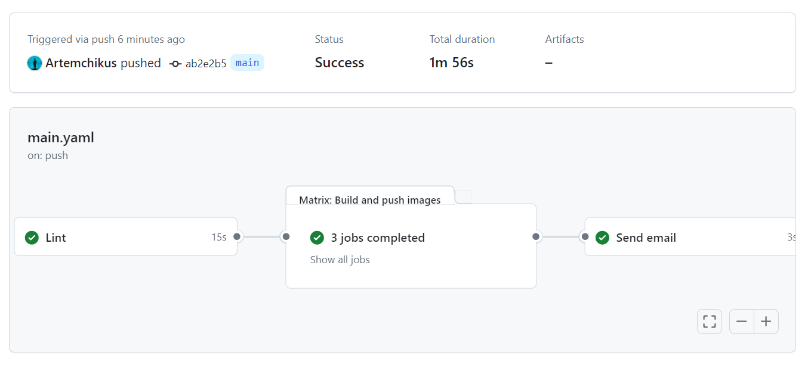
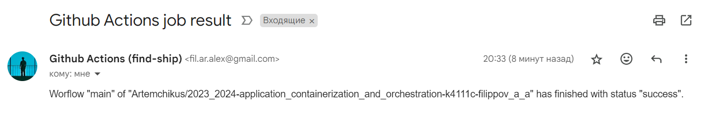

University: [ITMO University](https://itmo.ru/ru/)  
Faculty: [FICT](https://fict.itmo.ru)  
Course: [Application containerization and orchestration](https://github.com/itmo-ict-faculty/application-containerization-and-orchestration)  
Year: 2023/2024  
Group: K4111c  
Author: Filippov Artem Alekseevich  
Practice: practice3  
Date of create: 01.05.2024  
Date of finished: 03.05.2024  

Цель: установить и настроить специальные инструменты для автоматизации процесса тестирования и развертывания программного обеспечения.

Ход работы:

1. В качестве CI/CD инструмента использовался GitHub Actions, для которго дыл написан пйплайн с шагами проверки кода, сборки и отправки образов, а также оправки письма на почту в случае успешной сборки.

   ```yaml
   name: main
   on:
   push:
       branches:
       - "main"
       tags:
       - "v*"
   pull_request:
       branches:
       - "main"

   jobs:
   lint:
       name: Lint
       runs-on: ubuntu-latest
       steps:
       - uses: actions/checkout@v4
       - uses: actions/setup-go@v5
           with:
           go-version: "1.21.6"
       - name: golangci-lint
           uses: golangci/golangci-lint-action@v5
           with:
           version: latest
   build:
       needs: lint
       name: Build and push images
       runs-on: ubuntu-latest
       strategy:
       matrix:
           include:
           - image: artemchikus/find-ship
               dockerfile: Dockerfile
           - image: artemchikus/find-ship-update-urls
               dockerfile: ./cmd/cron_lobs/update_urls/Dockerfile
           - image: artemchikus/find-ship-migrations
               dockerfile: ./storage/Dockerfile
       steps:
       - uses: actions/checkout@v4
           name: Checkout
       - uses: docker/setup-qemu-action@v3
           name: Set up QEMU
       - uses: docker/setup-buildx-action@v3
           name: Set up Docker Buildx
       - uses: docker/login-action@v3
           name: Login to Docker Hub
           with:
           username: ${{ secrets.DOCKERHUB_USERNAME }}
           password: ${{ secrets.DOCKERHUB_TOKEN }}
       - uses: docker/metadata-action@v5
           name: Setup tags
           id: meta
           with:
           images: ${{ matrix.image }}
       - uses: docker/build-push-action@v5
           name: Build and push app images
           with:
           context: .
           file: ${{ matrix.dockerfile }}
           push: true
           tags: ${{ steps.meta.outputs.tags }}
           labels: ${{ steps.meta.outputs.labels }}
   email:
       needs: build
       if: always()
       name: Send email
       runs-on: ubuntu-latest
       steps:
       - name: Send mail
           uses: dawidd6/action-send-mail@v3
           with:
           server_address: smtp.gmail.com
           server_port: 465
           username: ${{secrets.MAIL_USERNAME}}
           password: ${{secrets.MAIL_PASSWORD}}
           subject: Github Actions job result
           to: fil.ar.alex@gmail.com
           from: Github Actions (find-ship)
           body: 'Worflow "${{ github.workflow }}" of "${{ github.repository }}" has finished with status "${{ needs.build.result }}".'
   ```

   
   

2. В качестве метода ветвления был выбран Central Workflow, так как проект является маленьким и коммитит в него только я. Рабочие вресии в монжо разделять релиз тегами. Что касается не реализованных шагов в пвйпланйе то это прогонка юнит тестов, деплой в тестовое окружение с прогонкой интеграционных тестов и деплой в прод окружение по нажатию кнопки.

Выводы: в ходе выполнения практической работы была выьрана схема ветвления проекта Central Workflow, а также платформа для реализации пайплайна GitHub Actions, после чего был написан пайплайн, реализующий проверку кода и сборку образов, с последующим пушем их в dockerhub.
